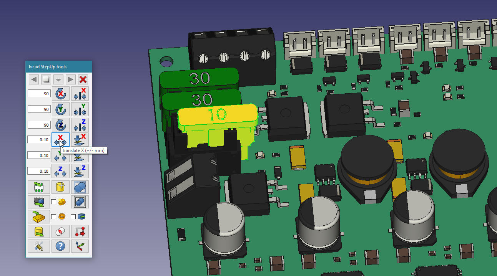
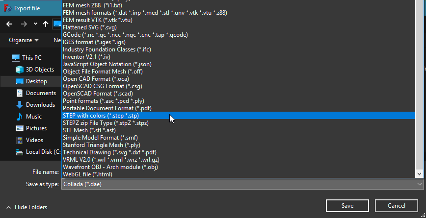
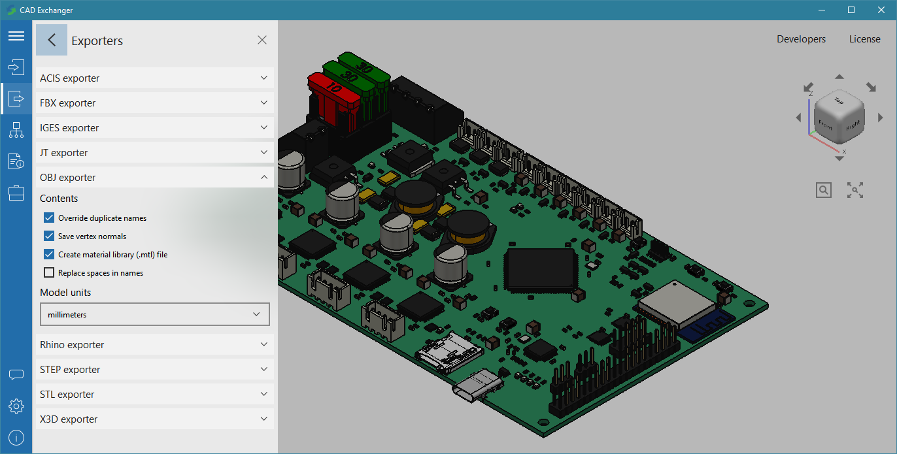
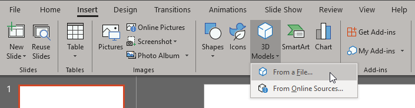
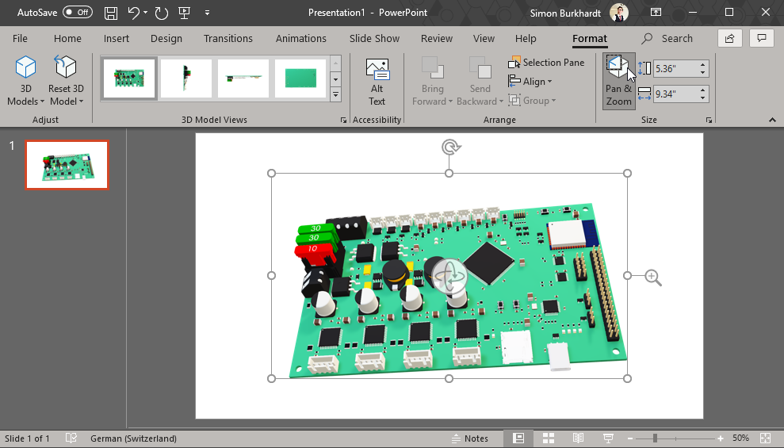
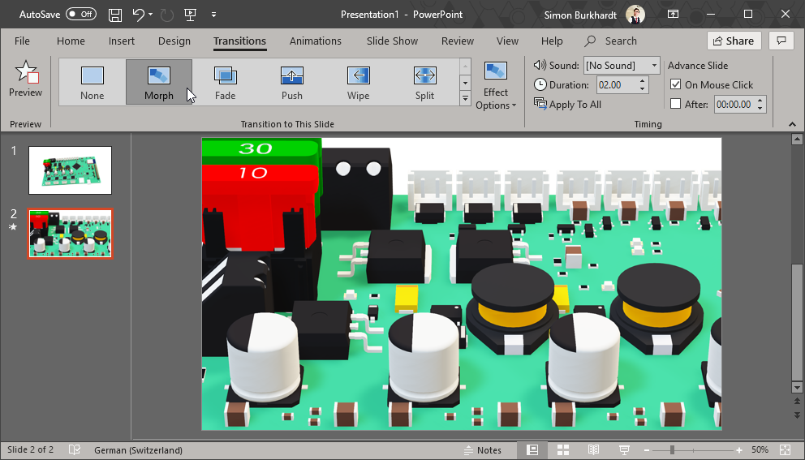

# KiCAD 3D File Export for PowerPoint (Tutorial)

---

In this tutorial I will explain how to:

1. export a 3D Model of your circuit board drawn in KiCad
2. convert the 3D Model to a PowerPoint-friendly file format
3. animate your 3D file in PowerPoint

---

## 1 Exporting your PCB

### 1.1 Adding 3D models to components

Make sure that all the Components on your PCB have a 3D Model.
If some don't have one, you can download 3D files from the manufacturer or other 3rd party websites. I recommend creating an account on Dassault's [3D Content Central](https://www.3dcontentcentral.com/). There you can search for parts and dowload the files in various file formats. For KiCad, use `.STEP (AP214)`.

### 1.2 Exporting the PCB to FreeCAD

#### 1.2.1 FreeCAD

To export the 3D models, you need a version of FreeCAD.

 [Free CAD](https://www.freecadweb.org/downloads.php)

#### 1.2.2 FreeCAD Extension for KiCad

In addition to open KiCad files, you need an extension named StepUp.

[KiCad-PCB.org](http://kicad-pcb.org/external-tools/stepup/)

[Github.com/easyw](https://github.com/easyw/kicadStepUpMod/)

> #### Installing

> (see above Github link for instructions)
> 
> Download and install your corresponding version of FreeCAD from wiki Download page and either install
> - automatically using the FreeCAD Add-on Manager (bundled in to 0.17 dev version under Tools Menu)
> - manually by copying the kicadStepUpMod folder to the Mod sub-directory of the FreeCAD application.

#### 1.2.3 Import PCB with FreeCAD

Now you are able to open the `.kicad_pcb` file with FreeCAD.
`File > Open > pcb.kicad_pcb`.
It will take some time to import all the components. There should appear another toolbar with the kicad SteepUp tools.
Once opened, you can check the 3D PCB for errors and missing components.
At the time of writing this tutorial, the StepUp tool seems to ignore the scaling factor of the 3D components.

Some components might be off by a few milimeters. Click on the component and use the kicad StepUp toolbar to move the object around.

#### 1.2.4 Export STEP File

Once you are completed adjusting the components you can save the project at a destination of your choice. Then select all 3D shapes by pressing `CTRL + A`. Now you can export the model by clicking `File > Export`

Select `STEP with colors (*.step)` and save the file to a destination of your choice.

---

### 2 Convert to PowerPoint friendly format

#### 2.1 CAD Exchanger

PowerPoint does not support the `.step` file format. 

> Supported 3D File Formats [support.office.com](https://support.office.com/en-us/article/3d-content-guidelines-for-microsoft-03a7b493-d549-4f1a-9735-f2457adf6261)

To convert the file you need a 3D file converter. The following tutorial uses CAD Exchanger to convert the `.step` file to a `.obj` file and `.mtl` file. The `.mtl` file is important, because it contains the color information.

 [cadexchanger.com](https://cadexchanger.com/)

#### 2.2 Convert using CAD Exchanger

Open CAD Exchanger and click `browse` to select your `.step` file. Once imported, you can click `Export` with the following settings:

---

### 3. Animate 3D Files in PowerPoint

Official Tutorial:

> Get creative with 3D models [support.office.com](https://support.office.com/en-us/article/get-creative-with-3d-models-ec5feb79-b0af-47f6-a885-151fcc88ac0a)

#### 3.1 Import the 3D file

#### 3.2 Animate the 3D file

You can now rotate the 3D file to a suitable position. 

Use the `Pan & Zoom` option to position the object in the first position.

Then duplicate the slilde and change the camera view to the second position.
Add the Transition: `Morph`. Repeat this step until you have covered all aspects of your PCB.

---

©2019 Simon Burkhardt - [github.com/mnemocron](https://github.com/mnemocron)

This work is licensed under a [Creative Commons Attribution-NonCommercial-ShareAlike 4.0 International License](https://creativecommons.org/licenses/by-nc-sa/4.0/).

